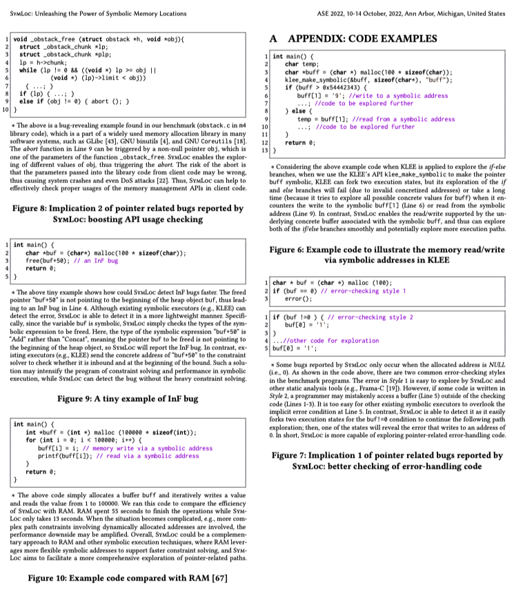

###  Please kindly check the following code examples mentioned in the paper:
* [click here to see a more clear version](./Appendix.pdf)




# Setup SymLoc
## Part A: Building tutorial

### Requirements
Install the following packages:
```
sudo apt-get install cmake bison flex libboost-all-dev python perl zlib1g-dev build-essential curl libcap-dev git cmake libncurses5-dev python-minimal python-pip unzip libtcmalloc-minimal4 libgoogle-perftools-dev libsqlite3-dev doxygen
pip3 install tabulate wllvm
```

### LLVM 9.0
```
wget http://releases.llvm.org/9.0.0/llvm-9.0.0.src.tar.xz
wget http://releases.llvm.org/9.0.0/cfe-9.0.0.src.tar.xz
wget http://releases.llvm.org/9.0.0/clang-tools-extra-9.0.0.src.tar.xz
tar xvf llvm-9.0.0.src.tar.xz
tar xvf cfe-9.0.0.src.tar.xz
tar xvf clang-tools-extra-9.0.0.src.tar.xz
mv llvm-9.0.0.src llvm-src
mv cfe-9.0.0.src clang
mv clang llvm-src/tools/clang
mv clang-tools-extra-9.0.0.src extra 
mv extra llvm-src/tools/clang/tools/extra
cd llvm-src
mkdir build 
cd build
cmake  -DLLVM_TARGETS_TO_BUILD=X86 -DCMAKE_BUILD_TYPE="Release"  -DCMAKE_INSTALL_PREFIX=./ -DCMAKE_C_COMPILER=clang -DCMAKE_CXX_COMPILER=clang++ ..
make -j8
make install
```

Update the following environment variables:
```
export PATH=<llvm_build_dir>/bin:$PATH
export LLVM_COMPILER=clang
```

### minisat
```
git clone https://github.com/stp/minisat.git
cd minisat
mkdir build
cd build
cmake -DCMAKE_INSTALL_PREFIX=/usr/local/ ../
sudo make install
```

### STP
```
git clone https://github.com/stp/stp.git
cd stp
git checkout tags/2.3.3
mkdir build
cd build
cmake ..
make
sudo make install
```

### klee-uclibc
```
git clone https://github.com/klee/klee-uclibc.git
cd klee-uclibc
git checkout 038b7dc050c07a7b4d941b48a0f548eea3089214 # we used that version in our experiments
./configure --make-llvm-lib
make
```

### Our Tool
To build our tool, do the following:
```
mkdir <klee_ram_build_dir>
cd <klee_ram_build_dir>
    cmake \
    -DENABLE_SOLVER_STP=ON \
    -DENABLE_POSIX_RUNTIME=ON \
    -DENABLE_KLEE_UCLIBC=ON \
    -DKLEE_UCLIBC_PATH=<klee_uclibc_dir> \
    -DLLVM_CONFIG_BINARY=<llvm_build_dir>/bin/llvm-config \
    -DLLVMCC=<llvm_build_dir>/bin/clang \
    -DLLVMCXX=<llvm_build_dir>/bin/clang++ \
    <symloc_dir>
make -j4
```

## Part B: Running results of the motivating example

* Suppose you have installed SymLoc and KLEE, and we run SymLoc and KLEE on the motivating example (mov.c) given in the paper.

```
#include <string.h>
#include<stdio.h>
#include<stdlib.h>
#include <wchar.h>
#include <unistd.h>

static char* bad(int a)
{
    if (a == 0x1234ABCD){
        int size = 1024;
        char * data1 = (char *) malloc(size * sizeof(char));
        char * start = data1;
        char * end = data1 + size;
        for (int i = 0; i < 1023; i++){
            if (start > end){
                abort();
            }
            start++;
        }
        return NULL;
    }
    if (a == 0x1234DCBA) {
        wchar_t * data1 = NULL;
        data1 = (wchar_t *)malloc(100*sizeof(wchar_t));
        if (data1 == NULL) { abort(); }
        wmemset(data1, L'A', 100-1);
        data1[100-1] = L'\0';
        free(data1);
        wprintf(L"%s\n", data1);
        return NULL;
    } else {
        char *data2 = NULL;
        data2 = (char*) malloc(100 * sizeof(char));
        if (data2 == NULL) { abort();}
        memset(data2, 'A', 100-1);
        data2[100-1] = '\0';
        free(data2);
        return data2;
    }
}

int main()
{
    int a ;
    read(0, &a, sizeof(int));
    char* ret = bad(a);
    if (ret != NULL)
        printf("%s\n", ret);
    return 0;
}
```

* Compile the program:
```
clang -c -g -emit-llvm mov.c -o mov.bc
```

* Run the program with SymLoc:
```
$symloc -libc=uclibc -posix-runtime mov.bc -sym-stdin 4
KLEE: NOTE: Using POSIX model: xxxx/build/Debug+Asserts/lib/libkleeRuntimePOSIX.bca
KLEE: NOTE: Using klee-uclibc : xxx/build/Debug+Asserts/lib/klee-uclibc.bca
KLEE: output directory is "xxx/examples/motivating-example-symloc/klee-out-1"
KLEE: Using STP solver backend
KLEE: WARNING: undefined reference to function: llvm.dbg.label
KLEE: WARNING ONCE: calling external: syscall(16, 0, 21505, 93825038806400) at runtime/POSIX/fd.c:991 10
KLEE: WARNING ONCE: Alignment of memory from call "calloc" is not modelled. Using alignment of 8.
KLEE: WARNING ONCE: Alignment of memory from call "malloc" is not modelled. Using alignment of 8.
KLEE: WARNING ONCE: calling external: printf(93825038318384) at runtime/POSIX/fd_init.c:134 7
RUNTIME fd_init.c klee_init_fds executed
RUNTIME fd_init.c __create_new_dfile executed
KLEE: WARNING ONCE: calling __klee_posix_wrapped_main with extra arguments.
KLEE: ERROR: mov.c:25: abort failure
KLEE: NOTE: now ignoring this error at this location
KLEE: ERROR: mov.c:16: abort failure
KLEE: NOTE: now ignoring this error at this location
KLEE: ERROR: mov.c:34: abort failure
KLEE: NOTE: now ignoring this error at this location
KLEE: WARNING ONCE: execute symbolic free !
KLEE: ERROR: mov.c:48: memory error: a use(read) after free is detected!
KLEE: NOTE: now ignoring this error at this location
0�XUU
KLEE: ERROR: libc/misc/wchar/wchar.c:774: memory error: a use(read) after free is detected!
KLEE: NOTE: now ignoring this error at this location

KLEE: done: total instructions = 39550
KLEE: done: completed paths = 6
KLEE: done: generated tests = 6
```

* Run the program with KLEE:
```
$klee -libc=uclibc -posix-runtime mov.bc -sym-stdin 4
KLEE: NOTE: Using POSIX model: xxx/build/Debug+Asserts/lib/libkleeRuntimePOSIX.bca
KLEE: NOTE: Using klee-uclibc : xxx/build/Debug+Asserts/lib/klee-uclibc.bca
KLEE: output directory is "xxx/examples/motivating-example-symloc/klee-out-1"
KLEE: Using STP solver backend
KLEE: WARNING: undefined reference to function: llvm.dbg.label
KLEE: WARNING ONCE: calling external: syscall(16, 0, 21505, 93825038593360) at runtime/POSIX/fd.c:991 10
KLEE: WARNING ONCE: Alignment of memory from call "malloc" is not modelled. Using alignment of 8.
KLEE: WARNING ONCE: calling __klee_posix_wrapped_main with extra arguments.
KLEE: WARNING ONCE: calling external: printf(93825038056936, 93825038568848) at mov.c:48 9

KLEE: ERROR: libc/misc/wchar/wchar.c:774: memory error: out of bound pointer
KLEE: NOTE: now ignoring this error at this location

KLEE: done: total instructions = 39618
KLEE: done: completed paths = 3
KLEE: done: generated tests = 3
```

**We can see that SymLoc detects all the *abort* failures and UAF bugs while KLEE can only detect one UAF bug.**

